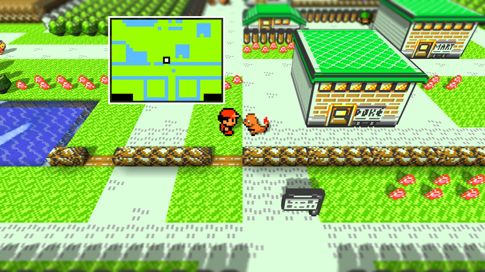

# Terrain Minimap for Gen1Recomp

A clean, player-centred terrain minimap for Pokémon Red in [Gen1Recomp](https://github.com/bryanthaboi/gen1recomp).



## Features

- Shows the terrain around the player in real time.
- Uses simple, high-contrast terrain colours: water, grass, walkable ground, doors/warps, solid terrain, and unexplored void.
- Continues into connected outdoor maps at map borders.
- Keeps the player centred with a clear white marker.
- Lets you configure visibility, Small/Medium/Large size, and all four screen corners in **OPTIONS → MINIMAP**.
- Draws only while the overworld is visible, keeping menus and battles clear.

## Installation

1. Download `terrain_minimap-1.0.0.zip` from the latest [Release](../../releases/latest).
2. In Gen1Recomp, open **MODS** and select **Import mod .zip**.
3. Choose the downloaded ZIP, enable **Terrain Minimap**, and apply the pending change if prompted.
4. Open **OPTIONS → MINIMAP** in-game to choose its size and corner.

## Screenshot and mod disclaimer

This repository distributes **only Terrain Minimap**. It does **not** contain, bundle, install, or require any other Gen1Recomp mods.

The screenshot is an example setup and may show visual changes made by separately installed mods. Those mods are not included here, are not required for Terrain Minimap, and remain the responsibility of their respective authors.

## Compatibility

- Gen1Recomp mod API 2
- Pokémon Red / Gen 1 only
- The mod reads Gen1Recomp's live map data, so it follows compatible map changes made by other mods.

## Legal

This project contains no Pokémon ROM, ROM-derived assets, extracted game data, or other copyrighted game files. You need your own legally obtained compatible Pokémon Red ROM to use Gen1Recomp. This is an unofficial fan project and is not affiliated with or endorsed by Nintendo, Game Freak, or The Pokémon Company.

## Development

Clone this repository into a Gen1Recomp checkout under `mods/terrain_minimap`, then run:

```sh
python3 tools/modkit.py validate mods/terrain_minimap --base imported
luajit mods/terrain_minimap/tests/minimap_core_test.lua
python3 tools/modkit.py pack mods/terrain_minimap
```

## License

The mod code and documentation are available under the [MIT License](LICENSE).
